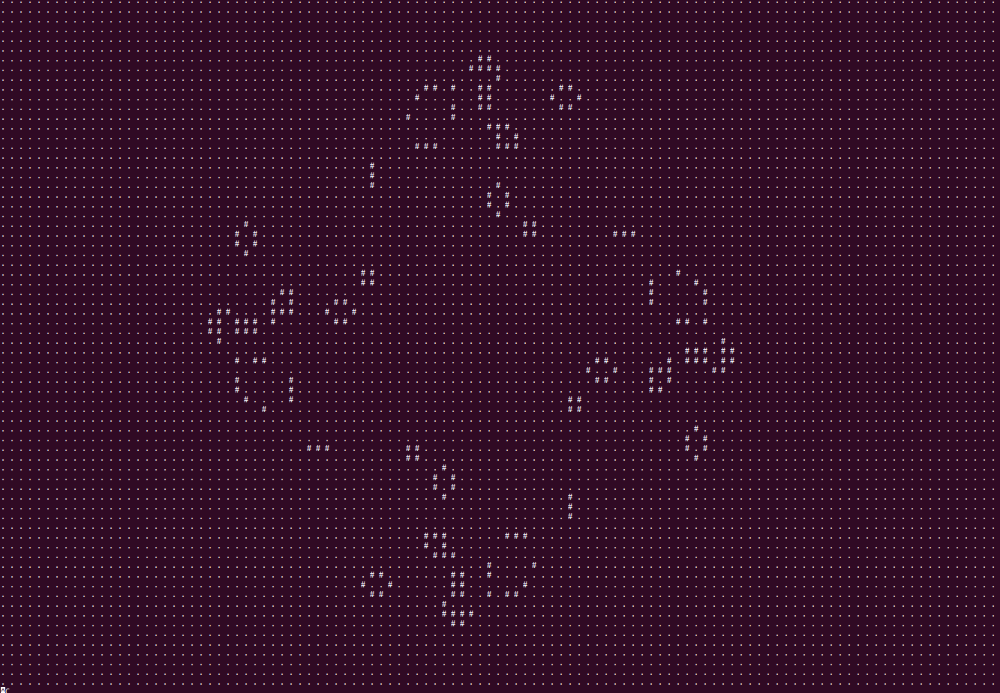

# Game-of-life

Simple program that simulate the game of life by John H. Conway.

The program need a simple text file to initialised the table


## Ready to start

```console
$ make all
$ ./main Gameinit.txt
```

## Exmple

[](/picture)
